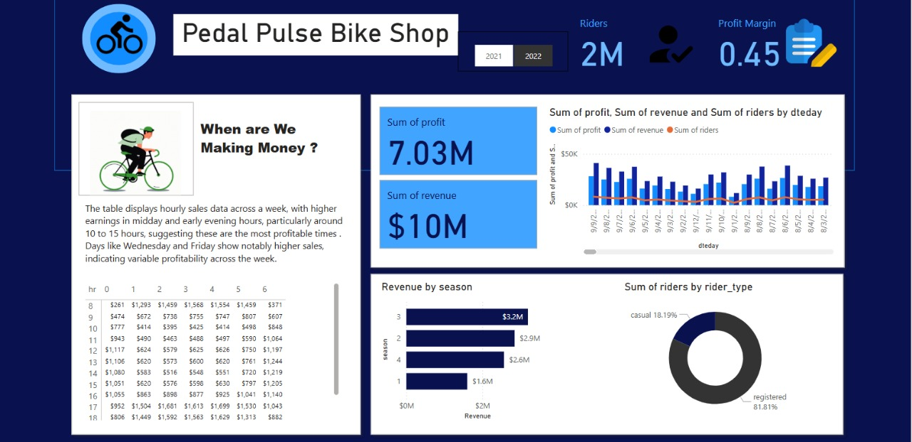

# 🚴 Pedal Pulse Bike Shop - Data Analysis Dashboard

  

## 📊 Project Overview
An end-to-end data analysis of bike-share business metrics using:
- **SQL Server** (Data cleaning & querying)
- **Power BI** (Interactive visualizations)

**Key Insights:**
- 📈 **revenue growth** (2021 → 2022)
- 🕒 Peak sales days: 
- 🧑🤝🧑 **count of registered riders**

---

## 🛠️ Tech Stack
| Component       | Technology Used          |
|----------------|-------------------------|
| **Database**   | SQL Server Management Studio |
| **ETL**        | SQL Queries             |
| **Visualization** | Power BI             |
| **Data Source** | Bike-share CSV files  |
